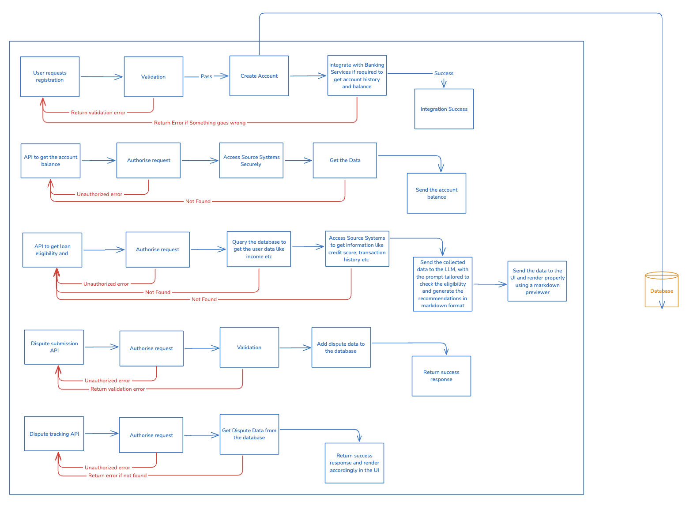

# Full-Stack AI Powered Customer Portal

### Self Service Portal for customers to

<ul> 
<li> Check Account Balance </li>
<li> Apply for a loan and receive AI generated recommendations</li>
<li> View dispute history and Track Resolution </li>
</ul>

UI Link: https://app.appsmith.com/app/loan-eligibility-checker/page1-67e9097353587352f0853da5 <br>
Demo Video: https://www.loom.com/share/7bbcd693fd7548c991e68d1e39b7ccf0

## How to build the MVP

So, to start building the MVP, first lets see what all things are we going to need

1. A frontend portal for letting users login, apply for a loan, get recommendation and check and track disputes. <br> So, we would require registration and login pages, along with OTP verification page. After login, we can redirect user to a dashboard, where we can give him options to <strong>Check Account Balance</strong>, <strong> Apply for a Loan and Get Recommendation </strong> and <strong> Submit and Track Dispures </strong> A mockup of the pages is available below. The loan eligibility pages have been created using AppSmith, so have added the same snapshots.


2. A backend server for managing authentication, collecting and processing data and generating responses. We'd need APIs for auth management, API for checking balance, APIs dispute submission and tracking and loan eligibility APIs.<br> So, we'd need the following elements on the backend side
<ul>
<li>
APIs to manage user registration and login.
</li>
<li>
Bank Source System APIs to integrate and verify user accounts, also to fetch account related information like balance etc
</li>
<li>
API to check the loan eligibility. This API would take some customer data as input like Income, Loan Amount, Loan Type and Credit Score. Based on these inputs, it would use an LLM (gemini-1.5.flash here) to check if the user is eligible for a loan or not based on standard and general banking policies. Also, based on the same, it would generate some feedback for the user, which maybe related to the loan plans and suggestions if eligible or recommendations and steps to become eligible for the loan
</li>
<li>
CRUD APIs for dispute, so that users can submit disputes, track them and maybe update them if required.
</li>
<li>
Further, some more elements like AI based dispute resolution might also be needed in the future scope.
</li>
</ul>
3. Integration of banking source system in order to track the balance <br>
4. A database to store the user data securely. <br>
5. An LLM like Gemini or Open AI's models to generate recommendations based on the collected data.



Given the timeframe of 24 hours and the fact that AI tools can be leveraged to build the tool, I'll follow the following strategy to develop the MVP.

1. I usually start building the server side first. So, we can have a couple of choices to espouse for the backend, powered by AI. Some logic, for e.g auth logic and quick API development can be done with the help of AI like GitHub copilot or Chat GPT etc. We can also use Supabase, which provides quick backend and data storage solutions, but I'm not pretty familiar with that, so I'd skip this option. So, I'd quickly get the API structure built using AI agents, then modify that as per the business logic and this should take no more than three hours. I'll use Flask to build the APIs
2. For data storage and authentication management, a quick implementation would be Firebase. Alternatively, we can setup MongoDB as well.
3. For developing the UI, I will use low-code platforms like AppSmith, where I can build the UI using drag-and-drop. It also supports API integration, so I can integrate my APIs quickly without the need to setting up API integration libraries like Tanstack Query (If using React for FE) or axios. Appsmith also hosts the application publicly, so there's no need to host the UI of the MVP on Vercel, Azure or any other hosting platform.
4. Once done, the things would need a little testing against different test cases including the edge cases.
5. Once this thing is tested, we can move ahead with the LLM integration part. We can do a quick implementation of any LLM using Langchain, which would take no more than three hours.
6. This way we can wrap up the MVP development of a self-service customer portal.

## If low code platforms were available, how would you use them to accelerate the development

1. If low code platforms were available, a lot of manual work could be reduced. For e.g the UI can be built using Appsmith using simple drag and drop. API integration is also seamless and there's no need to host. They provide a private/public link as well.
2. Rather than using a database, we can integrate Airtable or Google sheets again saving a ton of time.
3. Also, in MVPs are mostly to check if the product would work or not. So, if the business logic is connected to a streamlit app, it can be verified there as well. A few lines of code, and donnne.

# Project Setup and How to run

Since, this is a Python (Flask) prototype, following are the steps to run it

```
pip install -r requirements.txt
```

```
python app.py
```

If you want to run the streamlit version, run the following

```
streamlit run streamlit_version.py
```
